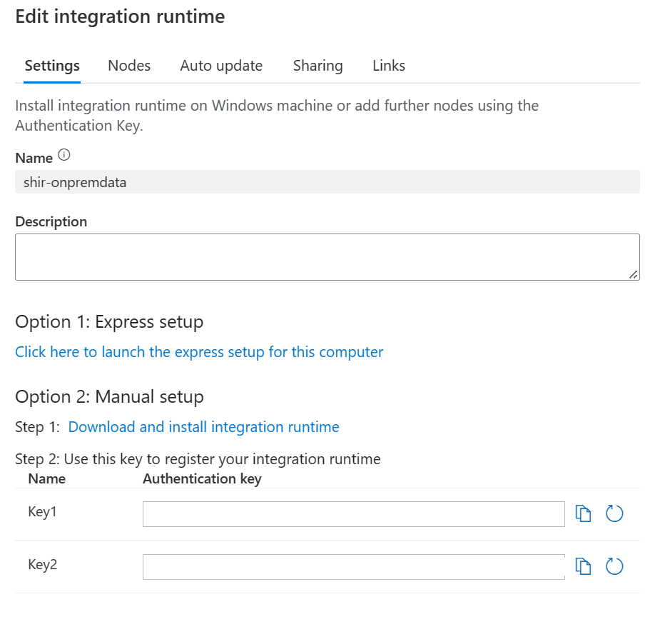
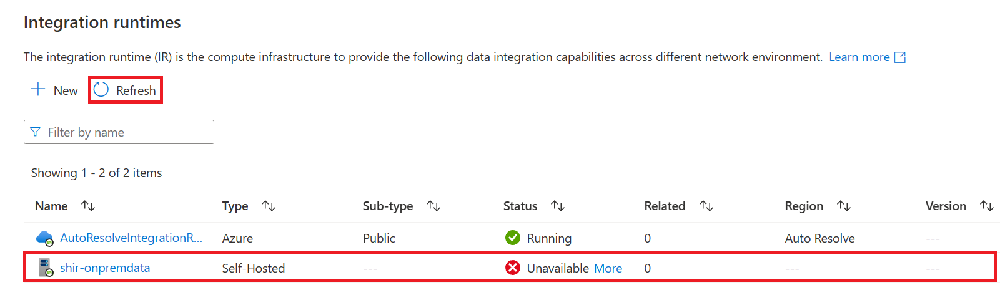

## Create Self Hosted Integration Runtime in Azure Data Factory
### Summary
The Self Hosted Integration Runtime will allow us to simulate the process of reaching back to an On Premesis source to retreive data. It requires set up in Azure Data Factory first, and then additional steps in the Virtual Machine provisioned for this exercise later.

### Steps
1) Go to [adf.azure.com](https://adf.azure.com) and choose the factory provisioned in deployment.
2) Follow the steps in the "Create a Self Hosted IR Via UI" section from this [guide](https://learn.microsoft.com/en-us/azure/data-factory/create-self-hosted-integration-runtime?tabs=data-factory#create-a-self-hosted-ir-via-ui). 
3) Once you've created the steps in that section, name your Integration Runtime and click Create
4) That will result on a screen giving you options to download an installer for the integration runtime like the one below. 

    

5) Close out of this screen and confirm the Integration Runtime has been created. If you don't see it click Refresh. **Note: It is expected that this will show Unavailable at this point. This will be resolved in upcoming steps..**

    