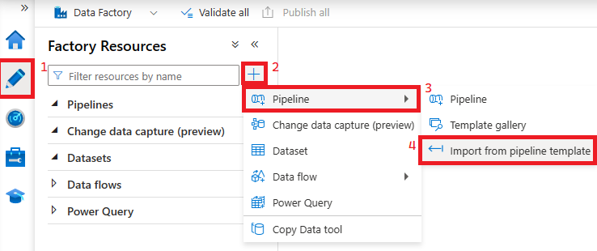
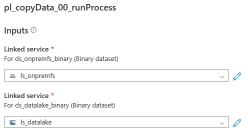
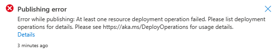
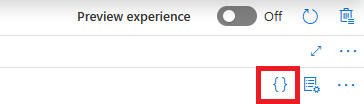

## Set up Datasets and Pipelines in Azure Data Factory
### Summary
This walkthrough will show you how to deploy the pre-made pipeline templates for this Proof of Concept to Azure Data Factory. Typically, you would create pipelines through normal development processes but these are created to exemplify some of Azure Data Factory's strengths. It is recommended to build frameworks that are highly parameterized in Azure Data Factory to allow them to be broadly applicble. 

### Steps
#### Add base pipelines and datasets
1) Follow the steps below to import a Pipeline template.

    

2) Open the [pl_copyData_00_runProcess.zip](../../code/adf/pipelines/pl_copyData_00_runProcess.zip) file.
3) Choose the Linked Services previously created in the following dialogue and click Use this template,

    

4) Publish your changes to deploy the 6 pipelines and 2 datasets that were contained in the pipeline template.

    **Note: If you receive the below error then go to the ls_onprem Linked Service and tick/untick the "Specify dynamic contents in JSON format." and publish again.**
    

#### Initialize Azure Table Store Metadata Store
1) Create a new pipeline named pl_tableStore_Initialize.
2) Locate the curly braces in the top right corner of the pipeline designer and click them to go into the Pipelin code editor.

    

3) Copy the contents of the [pl_tableStore_Initialize.json](../../code/adf/pipelines/pl_tableStore_Initialize.json) into the Pipelin code editor and click OK.
4) Click the Debug button in the pipeline editor.
5) Whe you're prompted to enter parameters enter them based on the resource names defined in your deployment. 
6) If all tasks are succesful then move on to the next step. If not, ensure you gave Azure Data Factory the Storage Table Data Contributor permission as detailed in the [previous step](../storage/addStorageMI.md).
7) Delete the createTable Activity from the pipeline.
8) Publish the pipeline.

