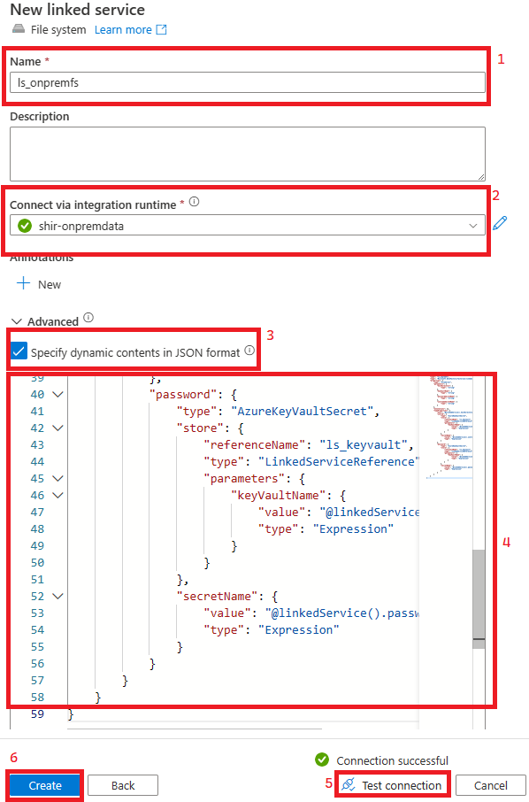
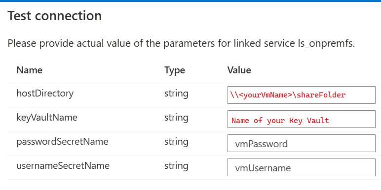
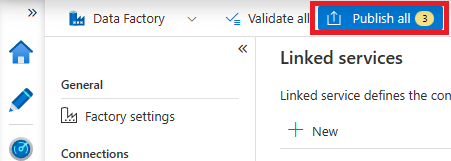

## Set up Linked Services in ADF
### Summary
Linked Services will define how we connect to the various integration points from Azure Data Factory. In this example, we'll set up connections to Azure Key Vault, Azure Data Lake Storage Gen 2, and the on-premesis filesystem residing on the Self Hosted Integration Runtime Virtual Machine.

### Steps
1) Return to [ADF](https://adf.azure.com)
2) Navigate to linked services and add a new service.

    

3) When prompted to choose a service search for Azure Key Vault, select it, and click Continue.
4) Follow the steps below to create the Linked Service for Azure Key Vault.

    

5) Create another new Linked Service following Step 2, choose File System when prompted, and set it up using the settings below. **Make sure you use the Self Hosted Integration Runtime as noted below**

    

6) Create the final Linked Service, choose Azure Data Lake Storage Gen2, and set it up using the settings below.

    

7) Click the Publish all button to save the Linked Services.
   
   

8) After publishing watch your Data Factory Notifications to ensure Linked Services were published.

   