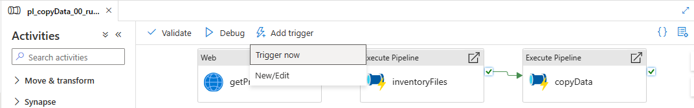
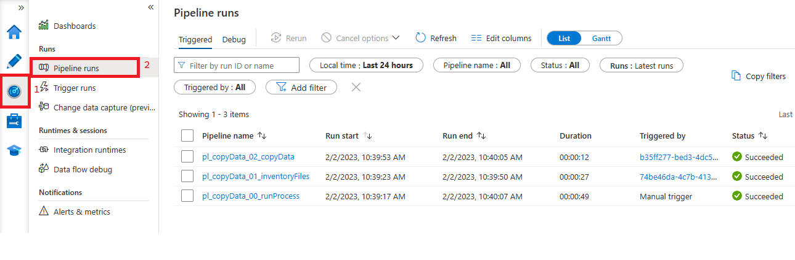

## Load Test Dataset through Pipelines 
### Summary
Below are steps to bring data to the Self Hosted Integration Runtime Virtual Machine and through the Azure Data Factory Pipelines to Azure Data Lake.

### Retreive Files and Put in Folder
1) Connect to your Virtual Machine through Bastion. (If you need a refresher follow this [guide](../shirvm/setup.md).)
2) Open a browser to this [link](https://uofi.app.box.com/v/NYCtaxidata/folder/2332219935).
3) Download all files named trip_data_number.zip.
4) Extract all CSV files to C:\shareFolder\tripdata.

### Run Azure Data Factory Pipeline
1) Open the pl_copyData_00_runProcess pipeline imported in the [previous step](./datasetsPipelines.md).
2) Click the Add Triger -> Trigger Now button.
    
3) When prompted to supply parameter use "tripdata" (no quotes) and click OK
4) Go to Monitor/Pipeline runs to watch your pipelin and ensure it completes successfully.
    