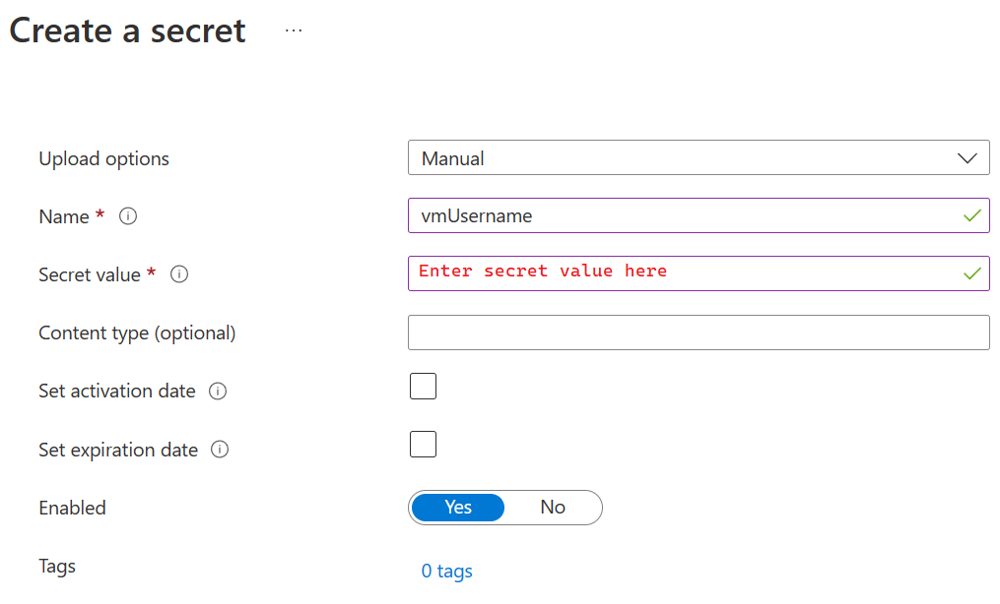

## Set up Azure Key Vault Permissions
### Summary
The steps are to set up the integration between Azure Key Vault and Azure Data Factory. Additionally, we'll set up secrets to be used in later processes.

### Steps
#### Permissions to Azure Key Vault
1) Go to the Azure Portal and the Azure Key Vault resource deployed in previous steps.
2) Go into Access policies and click to create a new policy.

    

3) On the permissions screen choose the "Secret Management" template.

    

4) On the next screen we'll be choosing to the Managed Identity representing our Azure Data Factory access as a Principal capable of Secret Management.

    

5) Click through the following two screens confirming that you are adding this principal and watch the top right corner of the Azure Portal for a notification affirming creation  of the permission.

    

6) Repeat steps 1-5 for your user so you can add Secrets to be used in later processes.

#### Create Secrets 
1) Go to the Azure Portal and the Azure Key Vault resource deployed in previous steps.
2) Follow the actions below to Generate a new Secret.

    

3) Create a secret named vmUsername that holds the Username created on deployment of the VM.

    

4) Repeat steps 1-3 to create a secret named vmPassword with the value of the Password for the VM created in deployment.