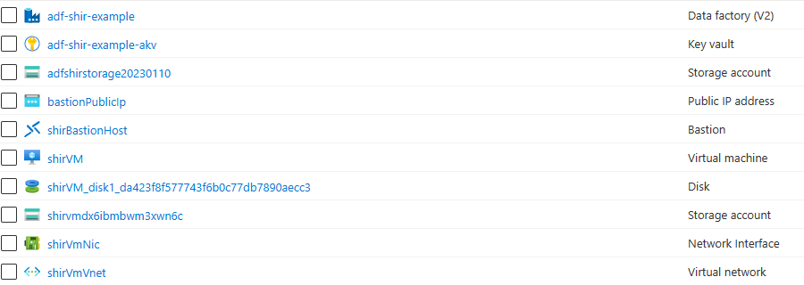

## Deploy resources to Resource Group
### Summary
Use VS Code to deploy resources to sandbox Resource Group.

### Steps
1) Open repository in VSCode
2) Locate the [deployall.bicep](../../deploy/deployall.bicep) script and follow this [guide](https://learn.microsoft.com/en-us/azure/azure-resource-manager/bicep/deploy-vscode) to deploy to your sandbox Resource Group.
3) OPTIONAL: Use the [deployall.paramaters.json](../../deploy/deployall.parameters.json) parameter file to pre-populate your parameters before deployment. 
4) Once deployment is complete, check your Resource Group for the below resources (the names will be whatever you assigned in the parameters).

    
