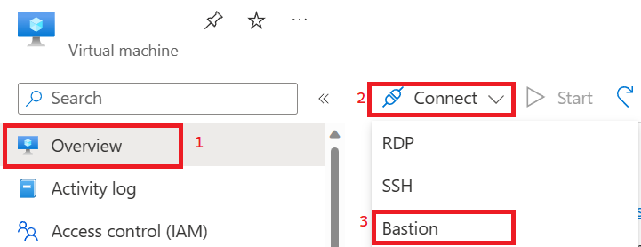
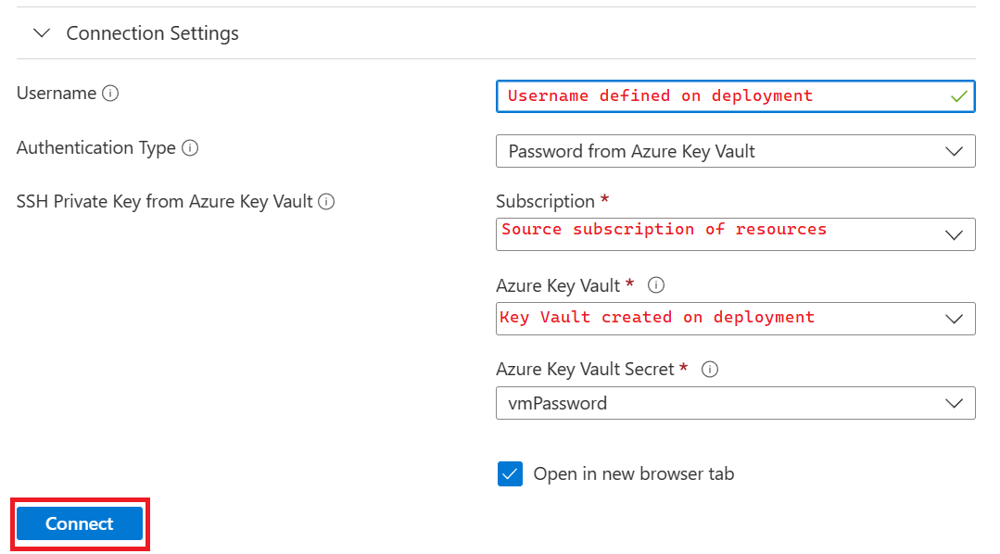
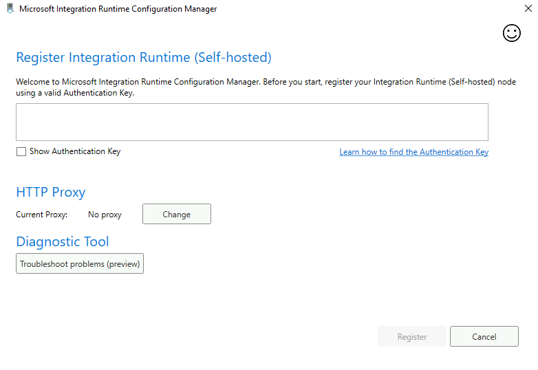
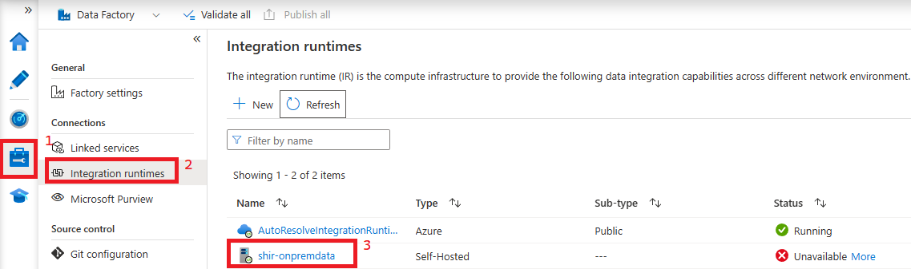
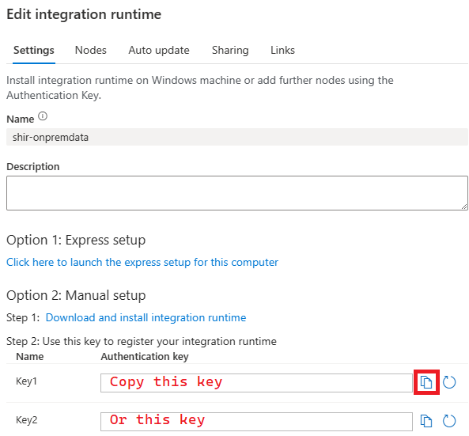
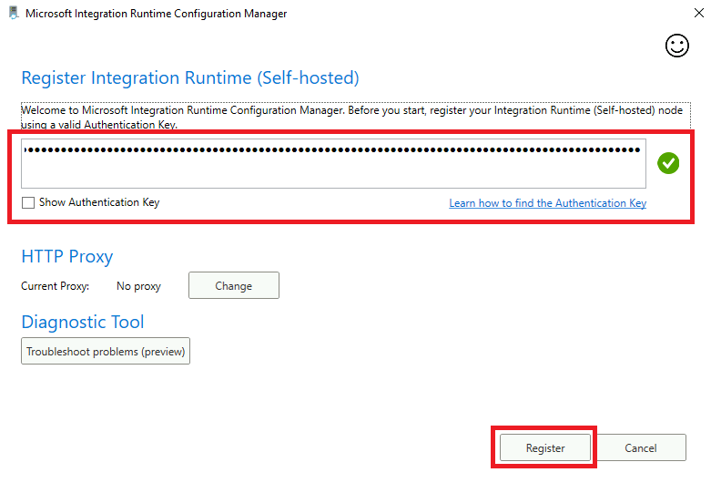
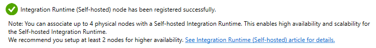
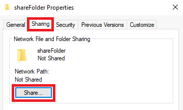
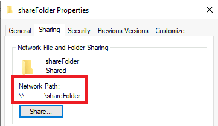
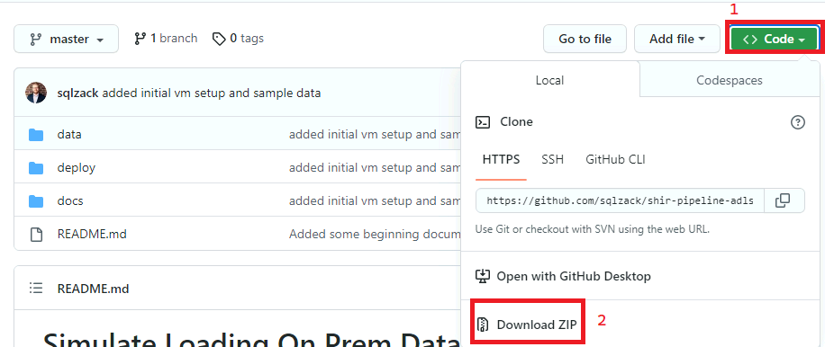

## Configuring Virtual Machine to Host SHIR and Data
### Summary
A Self Hosted Integration Runtime differentiates itself from a regular Azure Integration Runtime in Azure Data Factory by requiring infrastructure to be manually provisioned to host it. The steps in this walkthough serve as a guide to connect the Azure Data Factory resource to the Virtual Machine host. Also, you'll download some data to the host to be used in data loading and transformation exercises in ADF.
    
###  Steps
#### Log into Bastion Host
1)  Go to the Azure Portal and the Virtual Machine resource deployed in previous steps.
2)  On the Overview screen click Connect and select Bastion

      
3) On the subsequent screen either manually input the Virtual Machine Username and Password as defined on deployment or use the Azure Key Vault Secret created in previous steps.

      
4) This should open up a new browser window with your VM. If prompted to allow clipboard access you should allow as you'll likely be pasting text into Bastion in a future step.

#### Download Integration Runtime and Configure 
1) Open your VM per the instructions in the Bastion guide. 
2) Once in your VM, open up the Edge browser and follow this [link](https://www.microsoft.com/en-us/download/details.aspx?id=39717) to download the Integration Runtime Setup to your VM. (Choose the newest version available)
3) After the download has completed, run the Setup and install it to the default location. Once the Setup is complete, the below screen should show up.

      

4) Go to [adf.azure.com](adf.azure.com) in and follow the path below to bring up the Self Hosted Integration Runtime settings. *Note: The next step may be able to be performed on the VM if there are not machine certificate policies required to log in using Azure Active Directory. If not, use the browser on your local machine.*

      

5) Copy the key for use in manual set up as shown in the Screenshot below.

      

6) Return to the VM and the Integration Runtime Configuration Manager, paste the Authentication Key into the dialog box, and click Register. *If the Integration Runtime Configuration Manager is minimized, check your system tray*

      

7) On the next screen, review your Integration Runtime node name and click Finish.
8) Give the integration runtime a bit to initialize and you should receive the below message in the Integration Runtime Configuration Manager

      

9) Return to ADF and refresh your integration runtimes. Your Self Hosted Integration Runtime should now have the status of "Ready".

#### Create a Share
1) Open File Explorer on the VM and navigate to the C:\ drive.
2) Create a directory on C:\ called shareFolder
3) Right click on the newly created directory and select Properties.
4) In the Properties window select the Sharing tab and click Share.

      

5) Ensure your Admin user is included in the share list and click Share.
6) Do **NOT** turn on network discovery and file sharing at the next prompt.
7) Click done to complete setting up the share.
8) Once complete, right click to go into Properties for shareFolder again and you should be able to view the network path of your share. This will be used in later steps.

      

#### Put Sample Files in Share
1) On the VM, [open the repository](https://github.com/sqlzack/shir-pipeline-adls/) you're currently viewing.
2) Click on <>Code and download a zip of the repository to the Virtual Machine. 

      

3) Once the download is complete, extract the zip, navigate to the data directory, and locate sample.csv.
4) Copy sample.csv from the downloaded repository directory to a new directory called tripdata in C:\shareFolder.
   