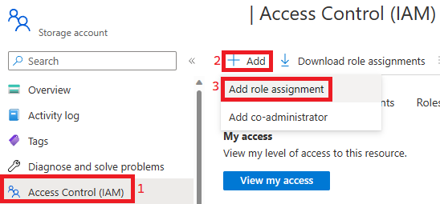
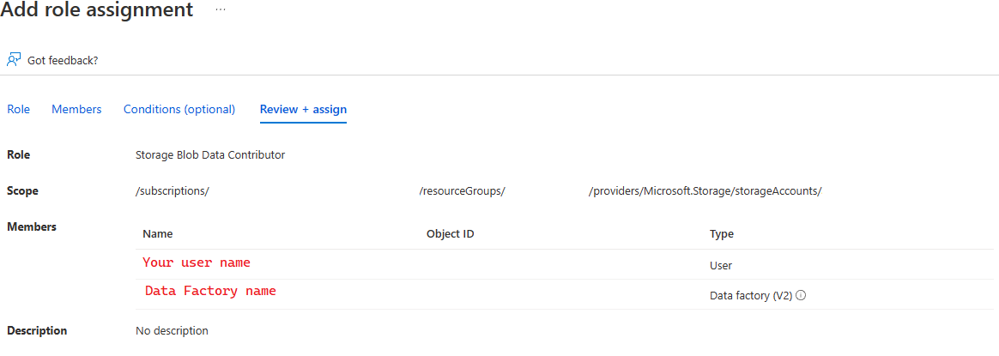
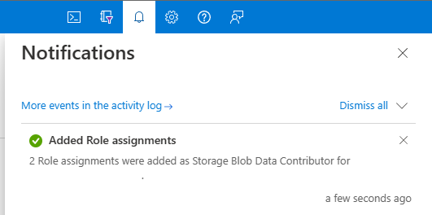

## Assign ADF Storage Blob Data Contributor on Storage
### Summary
This step walks through how to give Azure Data Factory's Managed Identity role based access to Azure Data Lake Storage. This will be helpful for moving the on prem files into the Data Lake through the Copy Activity.

### Steps
1) In the Azure Portal, navigate to the Storage Account defined in deployment. *Two storage accounts will exist. The correct storage account is the one named after the value of the storageAccountName parameter in deployment.*
2) Follow the screenshot below to create a role assignment on the storage account.

    

3) On the next screen search for and select Storage Blob Data Contributor and click Next.
4) On the next screen choose "User, group, or service principal" and click "+Select members".
5) Find your username and click Select
6) Click the "Managed Identity" radio button and click "+Select members" again.
7) Select your Subscription, Data factory (V2) in the Managed identity field, and find the Data Factory created in deployment. Click Select to continue.
8) Click "Review + assign"
9) The summary screen should look similar to the one below. Click "Review + Assign" again if it does. 

    

10) Watch your Portal notifications to ensure the Role Assignments are created correctly.

    

11) Repeat the process in steps 1-10 and give the Azure Data Factory Managed Identity the **Storage Table Data Contributor** role.