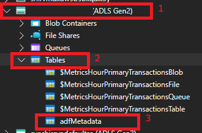
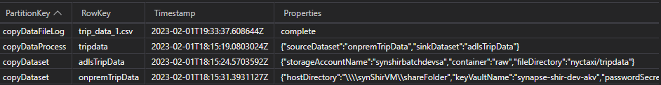

## Azure Table Store Metadata/Control Table Explanation
### Summary
The purpose of this walkthrough is to discuss the use of the Azure Table Store metadata repository in this Architecture. Table Store is used in this process to hold Source and Destination Copy Data Parameters and to perform light logging of files flowing thorugh. It is meant to be a Proof-of-Concept for how you can make your pipelines can be metadata driven but not meant to be used in any production capacity. A more thorough evaluation of needs would be assessed in that case.

### Accessing the Metadata Store
1) There are many ways to review the data in your Azure Table store but the most user-friendly way is through [Azure Storage Explorer](https://azure.microsoft.com/en-us/products/storage/storage-explorer/).
2) Once you configure with your Azure Active Directory Account, you will see a listing of all your storage accounts. To view the metadata table used in this architecture, locate the storage acount deployed with the architecture and the adfMetadata table within it. If you do not see adfMetadata, make sure you run the Initialize pipelin detailed in the [Datesets and Pipelines](../adf/datasetsPipelines.md) step.

    

### Explanation of metadata 

1) Metadata is grouped by Partition and Row Keys. More information on proper usage of these values [here](https://learn.microsoft.com/en-us/azure/architecture/best-practices/data-partitioning-strategies#partitioning-azure-table-storage). Essentially, the Partition Key will be used to group similar rows and the Row Key will serve as a Unique key for the row.
2) You'll also notice each row has a "Properties" column. This will hold different data depending on type of Partition and Row key varying from simple JSON to simple sring values.
3) The top level of the Partition Key is called "copyDataProcess". The Row Key values contained in this Partition Key should be a simple description of the type of data being copied from on-prem to your Data Lake. The Properties value will contain a JSON field contining properties for "sourceDataset" and "sinkDataset". The Initialize pipeline should set up a defaults as an example.
4) The next level down of Partition Keys is called "copyDataset". The Row Key should match something you eventually plan to use as the values for the sink and source properties in the rows with "copyDataProcess" Partition Keys. The Properties are details necessary to perform the Azure Data Factory Copy Data Activity. The initialize pipelin will set up defaults as an example.
5) The lowest level in this example is defined by the "copyDataFileLog" Partition Key. The RowKey within this Partition is the name of the file flowing through the Copy Data process. The Properties serve as a status for the Copy process. It can have the value of "copyDataProcess-inprocess", "error", or "complete". This will not be populated until you load files. **It is strongly reccommended that this logging is enhanced in production.**

### Reference 
- [REST API Reference](https://learn.microsoft.com/en-us/rest/api/storageservices/table-service-rest-api)
